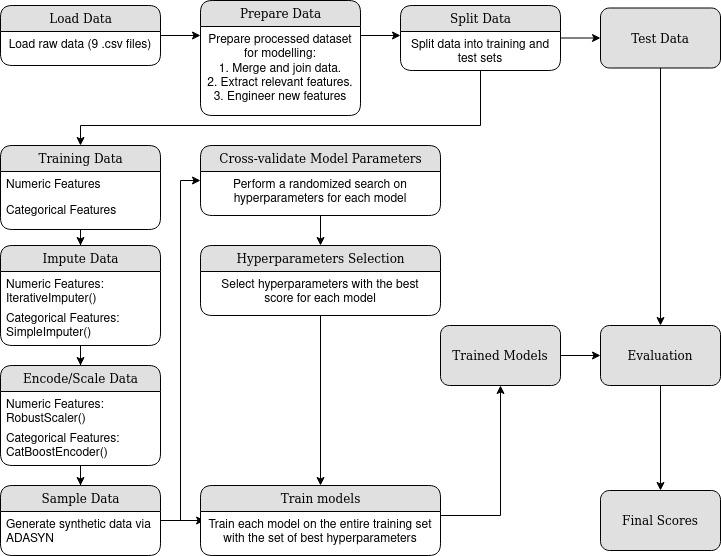

# Identifying Potential Repeat Buyers for Olist

by Rainer Kwan Mun Hin CAIE100288 (rainerkwan@gmail.com)

## Folder Structure

```
.
├── src/
│   ├── dataprep.py # Data Preprocessing
│   ├── model.py # Machine Learning Pipeline
│   └── config.yaml # Config File
├── results /
│   ├── cv_results.csv # Cross Validation Results
│   └── final_results.csv # Test Set Results
├── saved_model /
│   ├── saved_model.joblib # Saved Model
│   └── saved_model_results.csv # Results 
├── assets / 
├── data (Empty for Submission)
├── README.md
├── eda.ipynb
├── eda.pdf
├── requirements.txt
└── run.sh
```
## Build
This pipeline was built and tested on 

1. Ubuntu 20.04
2. Python 3.8.10

## Packages Required
1. category_encoders==2.5.0
2. geopy==2.2.0
3. imbalanced_learn==0.9.1
4. imblearn==0.0
5. ipython==8.4.0
6. joblib==1.1.0
7. lightgbm==3.3.2
8. matplotlib==3.5.3
9. missingno==0.5.1
10. numpy==1.21.5
11. pandas==1.4.2
12. PyYAML==6.0
13. scikit_learn==1.1.2
14. seaborn==0.11.2
15. xgboost==1.6.2
16. ipykernel==6.15.2 

## Pipeline Usage
On Terminal, navigate to the project directory and run the file run.sh. The pipeline will execute automatically and print and save results upon completion. The pipeline can also be configured to save and load machine learning models in the joblib format.
Changes to the configuration of the pipeline can be made via the configuration file 'config.yaml' located in the src folder.

### Configuration File Setup
1. To run and save new machine learning models, use the configuration below: 
```
# 'Run', 'Save', 'Load' are booleans
run: 1
save: 1
load: 0
```
2. To load a saved model and avoid running new models, use the configuration below:
```
# 'Run', 'Save', 'Load' are booleans
run: 1
save: 1
load: 0
```
3. Change the file directories of the datasets by modifying the paths below (note: the data folder will be empty in the submitted folder).
```
# Data Directory
olist_customers_dataset: '../data/olist_customers_dataset.csv'
olist_geolocation_dataset: '../data/olist_geolocation_dataset.csv'
```
4. Adjust parameters for the splitting of train and test sets:
```
# train_test_split
train_test_split_test_size: 0.3
train_test_split_random_state: 42
```
5. Choose sampling method (e.g. oversampling by ADASYN, SMOTE etc.)
```
sampling_method_lib: imblearn.over_sampling
sampling_method_func: ADASYN
sampling_method_params: {"random_state":42}
```
6. Choose imputation, encoding and scaling methods for categorical/numeric features. Example for categorical features shown below. 
```
# Imputer for Categorical Variables
cat_imputer_lib: sklearn.impute
cat_imputer_func: SimpleImputer
cat_imputer_params: {"strategy":constant, "fill_value":'missing'}

# Encoder for Categorical Variables
cat_encoder_lib: category_encoders.cat_boost
cat_encoder_func: CatBoostEncoder
cat_encoder_params: {"random_state":42}
```
7. Choose models to run in the pipeline by including the library and function names of the models as key, value pairs in the models dictionary.
``` 
models: {
          'xgboost': XGBClassifier,
          'sklearn.linear_model': LogisticRegression
        }
```
8. Choose model hyperparameters to perform a random search (RandomizedSearchCV) on. Each parameter has to start with 'classifier__' followed by its name so that it will be automatically identified by the pipeline. All scikit-learn estimators (and lightgbm  / XGBoost) are supported without requiring any additional library imports.  
```
params: {'XGBClassifier':
             {
              "classifier__learning_rate" : [0.01,0.05,0.10,0.20,0.30],
              "classifier__max_depth" : [3,4,5,6,8,10,15],
              "classifier__min_child_weight" : [1,3,5,7],
              "classifier__gamma": [0.0,0.1,0.2,0.3,0.4 ],
              "classifier__colsample_bytree" : [0.3,0.4,0.5,0.7],
              "classifier__scale_pos_weight": [1,10,19,25,50,75,100,200,300,500,1000],
              "classifier__random_state":[42]
             },
        'LogisticRegression':
             {
              'classifier__solver': ['newton-cg', 'lbfgs', 'liblinear'],
              'classifier__penalty': ['none', 'l1', 'l2', 'elasticnet'],
              'classifier__class_weight': ['balanced','none']
             },
         }
```
9. The scoring metrics can also be configured. Refer to the scikit-learn documentation [here](https://scikit-learn.org/stable/modules/model_evaluation.html) for the string names of each scoring method.
```
#scoring (for both CV and model evaluation)
scoring: ['accuracy', 'precision', 'recall', 'f1', 'roc_auc']
```
10. Lastly, we can also configure the parameters of RandomizedSearchCV and the number of cross-validation folds.
```
#RandomizedSearchCV parameters
RandomizedSearchCV_cv: 3
RandomizedSearchCV_n_iter: 5
RandomizedSearchCV_scoring: 'roc_auc'
RandomizedSearchCV_n_jobs: -1
RandomizedSearchCV_scoring_verbose: 100
RandomizedSearchCV_return_train_score: True
RandomizedSearchCV_random_state: 42

#Cross-Validation folds (for comparing models after hyperparameter tuning)
cv: 5
```
### Additional Customizations
Adjust the duration after a customer's first order whereby he is considered churned (non-repeat customer) if he does not place a second order.  
``` 
# Adjust churn day limit
churn_day_limit: 183
```
Save the prepared dataset to the /data folder (by default 0).
```
# Save final dataframe (prepared dataset)
save_df: 0
```

## Key Findings

### Feature Engineering
Creating new features from existing features is a useful step in the modelling process as it maps interactions between variables in a concrete manner.

1. Geospatial Features such as city/state/coordinates belonging to customers and sellers can be used to calculate the distance between a seller and customer. This distance should affect the amount of time it takes for an order to ship and be delivered to a customer and it might influence whether a customer orders again.

2. As mentioned in the point above, delivery times can be useful when predicting whether a customer orders again. The dataset contains timestamps for purchase time, estimated delivery time and actual delivery time, thus 3 new features are created from the timestamps: purchase time to estimated delivery time, estimated delivery time to actual delivery time and purchase time to actual delivery time.

### Considerations for Data Transfomation
1. The target variable 'repeat_customer' is highly skewed (<5%). Consider methods such as oversampling to balance out the observations or assigning class weights while training models to as to alleviate the imbalance.

2. The dataset contains both numeric and categorical features. Therefore, applying different transformations to numeric and catergorical features will be ideal.

3. For numerical features, there are 14 features with missing data. Multiple imputation is preferred as it imputes missing values by modeling each feature as a function of other features in a round-robin fashion,
   giving more accurate results for missing data.

4. For categorical features, we replace all null values with 'missing' which allows null values per feature to be treated as a single category.

5. There are some legitimate orders that appear as outliers and some numerical features are heavily left-skewed (e.g. payment value). To allow for fairer comparison between different Machine Learning algorithms (some do not handle outliers well, some require normalization to perform better etc.), scale all numerical features with scikit-learn's RobustScaler as it scales features using statistics that are robust to outliers.

6. For categorical features, avoid encoding methods that increase dimensionality (e.g. one-hot encoding) as there are already 27 features in the dataset.

7. Geospatial features such as city/state and product information have high cardinality. Thus, it is best to use a method such as CatBoost encoding to derive numbers for each category to reduce cardinality.
   CatBoost is preferred over target encoding as it is less likely to overfit on the training data.

## Pipeline Flow/Description
In general, the flow of the pipeline follows the steps listed below:

1. Data preparation
2. Split data into training and test sets
3. Transform data (Imputation/Encoding/Scaling)
4. For each algorithm, Perform k-fold stratified cross-validation to find the set of best hyperparameters
5. Train models on the whole training set using the best hyperparameters found in step 4.
6. Evaluate models using the test set.
7. Compare the performance of the models using suitable metrics (e.g ROC-AOC score)

The diagram below provides a visual representation of the pipeline.



## Choice of Models
For choice of models, Logistic Regression and XGBoost were chosen for the machine learning pipeline. 

### Why XGBoost?
1. XGBoost has built-in regularization which prevents the model from overfitting
2. XGBoost generally has good model performance compared to most other machine learning algorithms
3. XGBoost handles large-sized datasets well and tends to have good execution speed.

### Why Logistic Regression?
1. Logistic Regression is straightforward to implement: little hyperparamter tuning is required.
2. Results derived from Logistic Regression are highly explainable (through model coefficients)
3. Logistic Regression has been widely used in churn modelling. 

## Model Evaluation
The ROC-AUC score will mainly be used to evaluate and compare model performance. The ROC-AUC score is the measure of the ability of a classifier to distinguish between classes. The higher the score, the better the performance of the model at distinguishing between the binary classes. The baseline score is 0.5, which means the classifier is as accurate as random guessing. Thus, at the minimum, models should have a score higher than 0.5 to have any real-world usefulness.

The results of the tuned models evaluated on the test set are shown below (other metrics are also shown to give a full picture of model performance):

| model              | accuracy    | precision   | recall      | f1          | roc_auc     |
| ------------------ | ----------- | ----------- | ----------- | ----------- | ----------- |
| XGBClassifier      | 0.965687    | 0.304348    | 0.010072    | 0.019499    | 0.504632    |
| LogisticRegression | 0.617537    | 0.050979    | 0.584173    | 0.093775    | 0.601440    |         

Despite being the conventionally better algorithm, XGBoost was outperformed by Logistic Regression, with a ROC-AUC score of just 0.5 compared to 0.6 of Logistic Regression. A score of 0.6 indicates that Logistic Regression performed better than random guessing. 

The high accuracy scores attained by the XGBoost classifier may be misleading. As the dataset is heavily skewed, the results imply that XGBoost chose the negative classification more often than logistic regression, which lead to the high accuracy score. However, it was very poor at predicting any repeat customers at all, as the recall was just 0.01. This implies that if there were actually 100 repeat customers in a dataset, the XGBoost model would only correctly identify just 1 of them. On the hand, Logistic Regression identified 58% of all repeat customers. For Olist, a model with a higher recall score is more useful than one with a high accuracy score; A high recall allows Olist to still selectively target potential repeat customers, without fear of missing out on any actual repeat customers.

In conclusion, Logistic Regression performed better than XGBoost and is more suitable for Olist in predicting potential repeat customers.

## Other Considerations for Model Deployment
1. Data Drift. The original model may work for the original dataset it was trained on but it may not hold up for future customers. Customer patterns can change rapidly over time and consistent monitoring of model performing is required. 

2. Data Quality. The data quality of future data may be worse than the original dataset (e.g. more missing/duplicate/poorly recorded data). As the data quality degrades, so would the quality of predictions.

3. The deployed model should be explainable to stakeholders. This will allow stakeholders to work on improving areas of weakness the model has identified. Conversely, a black-box model may prevent stakeholders from figuring out the root causes of poor sales.

## Future Improvements
1. More machine learning algorithms could be explored (e.g. Neural Networks, Support Vector Machines, K-Neighbours Classifier). However, due to the high computational time required to evaluate all the models, they were omitted in favour of models that are likely to perform better with faster execution speeds.

2. Topic modeling/sentiment analysis of review comments and titles could be considered. However, it poses two big challenges. The comments are in Portuguese while most NLP libraries are trained and built on English. The most feasible way would be to translate the comments into English before feeding them into a NLP model. However, translating all the comments and performing NLP on such a huge dataset is both highly time-consuming and resource-intensive. Thus, it was excluded from the EDA and end-to-end machine learning pipeline.  

3. Geospatial features could be linked to the social demographics of customers e.g. Customers living in affluent areas may be inclined to make more orders.

## Addendum
The geographical distribution of customers and sellers can viewed on Tableau Public via this [link](https://public.tableau.com/app/profile/rainer.kwan/viz/OlistGeographicalDistributionofCustomersandSellers/Dashboard1).